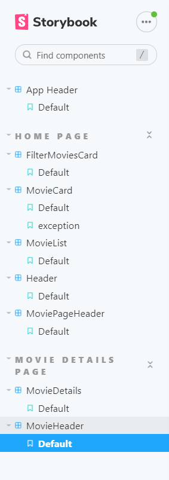
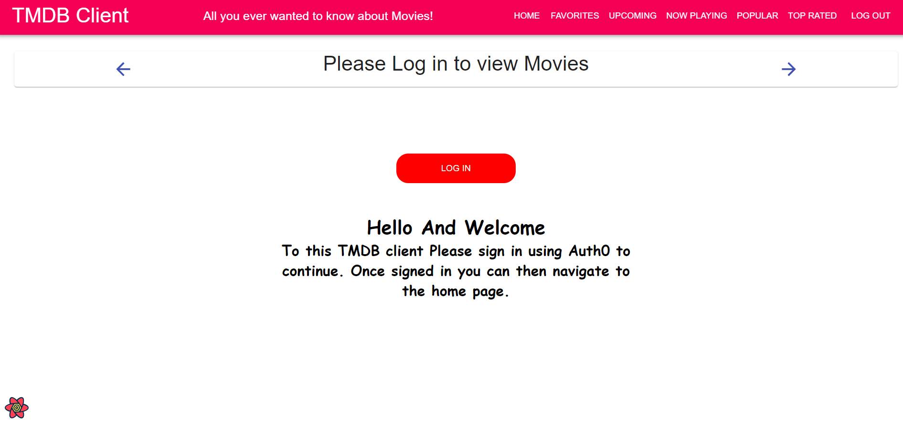
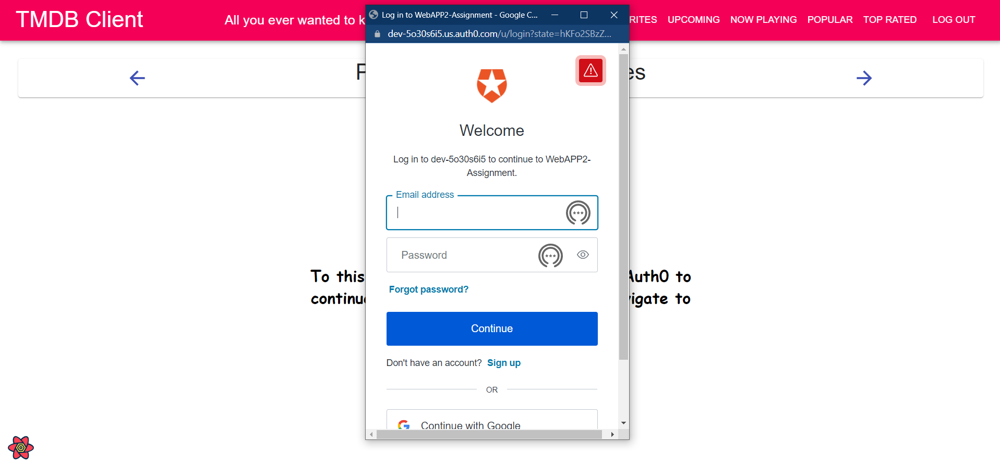
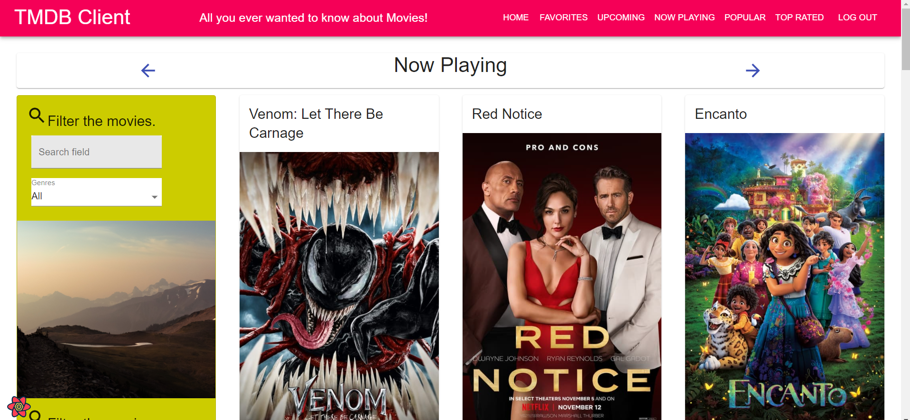
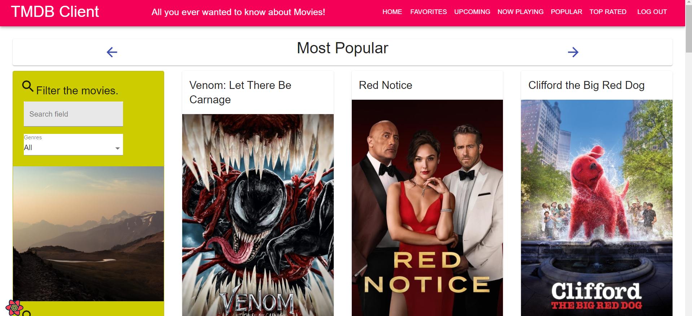
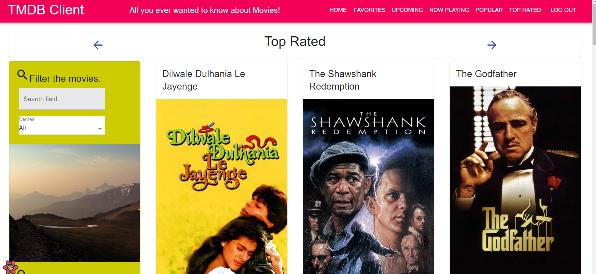
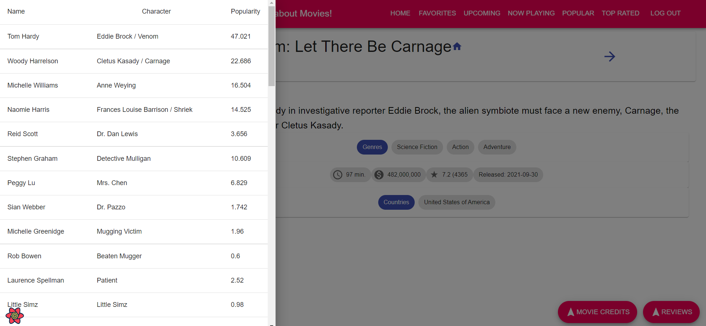

# Assignment 1 - ReactJS app.

Name: (Mustafe Abdi)

## Overview.

In this Repository you'll find a Web application that uses the TMDB (The Moives Data Base ) API where you can browse different movies by different catagories e.g Now Playing or Top Rated. The movies can be filtered based on genre and can be chosen as a favourite where it will be listed in the favourite tab.

### Features.
 
+ Added a Now Playing Tab
+ Added a Popular Tab
+ Added a Top Rated Tab
+ Added a Login page with protected routes
+ Added User Authentication using Auth0
+ Added a Movie Credits Tab where you can view the cast of the movies

## Setup requirements.

To run locally you need to follow the following steps

Run the commands : 1.npm install 2.npm install @auth0/auth0-react

Then you need to create a .env file in the main directory and paste in the following

REACT_APP_TMDB_KEY=3d548631cc7cfc789c8fbbe397fbcfe1 FAST_REFRESH=false

REACT_APP_AUTH0_DOMAIN=dev-5o30s6i5.us.auth0.com REACT_APP_AUTH0_CLIENT_ID=byCv3riJihQIe5eLnvZlAdJdDigaVZ3E

Then just run the command npm start

## API endpoints.

+ Now Playing - /movies/nowplaying (Displays the moves playing at the moment)
+ Popular - /movies/popular (Displays a list of popular Movies)
+ Top Rated - /movies/topRated (Displays a list of the Top rated movies)
+ Credits - (Shows a list of the cast in the movie) 

## App Design.

### Component catalogue.

[ Insert a screenshot from the Storybook UI that lists all the stories for the app's components, and highlight those relating to your __new/modified components__ - see the example screenshot below.] .......

### UI Design.

### UI Design.
Login Page 

Login Using Aut0

Now Playing Page - displays a list of movies that are currently playing

Popular Page - displays a list of movies that are currently popular

Top Rated Page - displays a list of movies that are Top Rated

Credits Page - displays a list of the actors in the movie

### Routing.

[ List the __new routes__ supported by your app and state the associated page.]

+ /blogs - displays all published blogs.
+ /blogs/:id - displays a particular blog.
+ /blogs/:id/comments - detail view of a particular blog and its comments.
+ etc.

[If relevant, state what aspects of your app are protected (i.e. require authentication) and what is public.]

## Independent learning (If relevant).

[ Itemize the technologies/techniques you researched independently and adopted in your project, i.e. aspects not covered in the lectures/labs. Include the source code filenames that illustrate these (we do not require code excerpts) and provide references to the online resources that helped you (articles/blogs).
